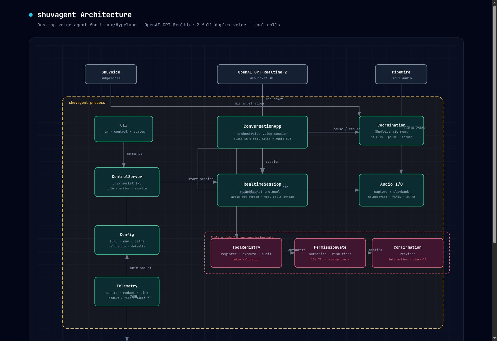

# shuvagent

`shuvagent` is a desktop voice-agent app for Linux/Hyprland built on OpenAI's GPT-Realtime-2 API. It is separate from ShuVoice: ShuVoice owns push-to-talk dictation, while shuvagent owns conversational voice sessions, desktop context reads, and permission-gated tool calls.



## Status

Foundation work is implemented through the first conversational slices:

- config loading from TOML and local env files
- Unix socket control server
- ShuVoice mic-arbitration coordination
- audio capture and playback primitives
- realtime session protocol plus fake session tests
- OpenAI Realtime WebSocket session implementation
- read-only desktop tools for selection, clipboard, active window, and ShuVoice status
- streaming CLI run path wired through the app/session loop

The remaining product work is tracked in [`PLAN-01-bootstrap-and-first-slice.md`](PLAN-01-bootstrap-and-first-slice.md).

## Architecture

The process is intentionally small and explicit:

- `shuvagent.cli` handles command-line entry points.
- `shuvagent.control` exposes local IPC over `$XDG_RUNTIME_DIR/shuvagent/control.sock`.
- `shuvagent.app.ConversationApp` coordinates realtime sessions, audio, tool calls, and ShuVoice pause/resume behavior.
- `shuvagent.realtime` contains the protocol, fake session, and OpenAI WebSocket implementation.
- `shuvagent.audio` handles PipeWire/PortAudio capture and playback through `sounddevice`.
- `shuvagent.tools` routes every tool call through `ToolRegistry`, `PermissionGate`, optional confirmation, and an audit result.
- `shuvagent.telemetry` emits redacted structured events.

The default security posture is deny-by-default. Model events do not call handlers directly; they must pass through a gated tool-call token.

## Relationship To ShuVoice

ShuVoice always wins mic contention. On session start, shuvagent checks `shuvoice control status`; if ShuVoice is recording, the agent refuses to start. During an active session, shuvagent polls ShuVoice and pauses its realtime session when push-to-talk becomes active.

Useful ShuVoice commands:

```bash
shuvoice control status
shuvoice control tts_stop
shuvoice control debug_status
```

shuvagent treats these as subprocess boundaries. It does not import ShuVoice internals.

## Requirements

- Linux with PipeWire/PortAudio-compatible audio devices
- Hyprland for active-window context helpers
- Python 3.12+
- `uv`
- `OPENAI_API_KEY` for live GPT-Realtime-2 sessions
- optional: `wl-paste`, `hyprctl`, and `shuvoice` on `PATH` for read-only desktop helpers

## Install

```bash
uv sync
cp examples/config.toml ~/.config/shuvagent/config.toml
cp examples/local.dev.example ~/.config/shuvagent/local.dev
```

Edit `~/.config/shuvagent/local.dev` and add:

```bash
OPENAI_API_KEY=...
```

## Run

Start a conversational session:

```bash
uv run shuvagent run
```

Check control status:

```bash
uv run shuvagent status
```

Use the Python module entry point:

```bash
uv run python -m shuvagent --help
```

## Configuration

Default paths:

```text
~/.config/shuvagent/config.toml
~/.config/shuvagent/local.dev
$XDG_RUNTIME_DIR/shuvagent/control.sock
~/.local/share/shuvagent/
```

Example files live in [`examples/`](examples/):

- [`examples/config.toml`](examples/config.toml)
- [`examples/local.dev.example`](examples/local.dev.example)
- [`examples/hyprland-bind.conf`](examples/hyprland-bind.conf)

## Development

Run the validation suite:

```bash
uv run ruff check .
uv run mypy
uv run pytest
```

Live OpenAI smoke tests are gated by `OPENAI_API_KEY`; fake-session tests run without network credentials.

## Tech Stack

| Layer | Choice |
|---|---|
| Language | Python 3.12 |
| Package manager | uv |
| Realtime transport | WebSocket |
| Audio | PipeWire/PortAudio via sounddevice |
| Config | TOML via stdlib tomllib |
| Tests | pytest |
| Lint/types | ruff, mypy |

## Project Docs

- [`AGENTS.md`](AGENTS.md) - operational constraints for coding agents
- [`PLAN-01-bootstrap-and-first-slice.md`](PLAN-01-bootstrap-and-first-slice.md) - implementation roadmap
- [`assets/architecture.html`](assets/architecture.html) - source HTML for the architecture screenshot

## License

MIT. A standalone `LICENSE` file should be added before the first public release.
